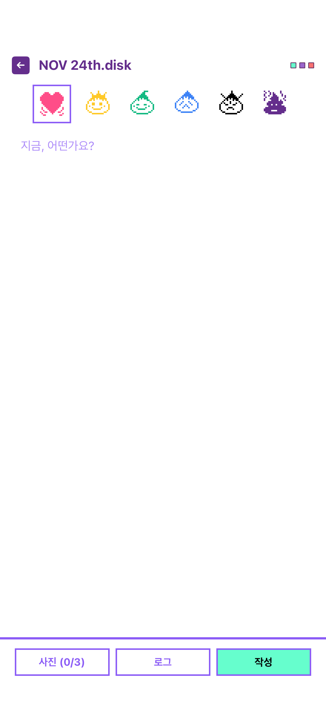
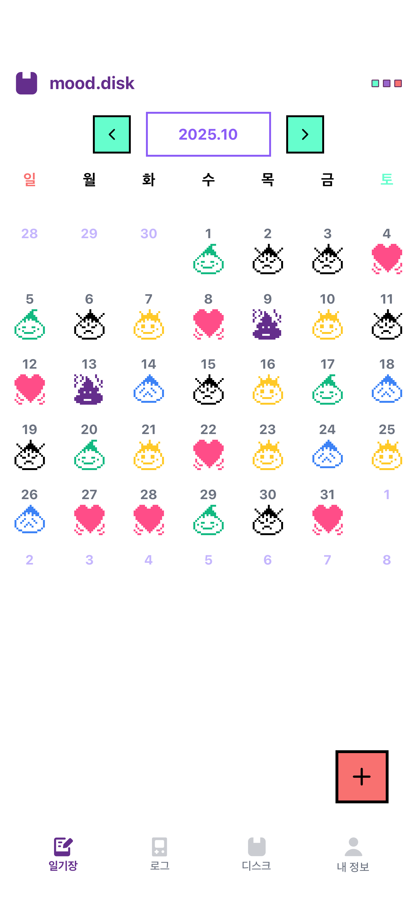
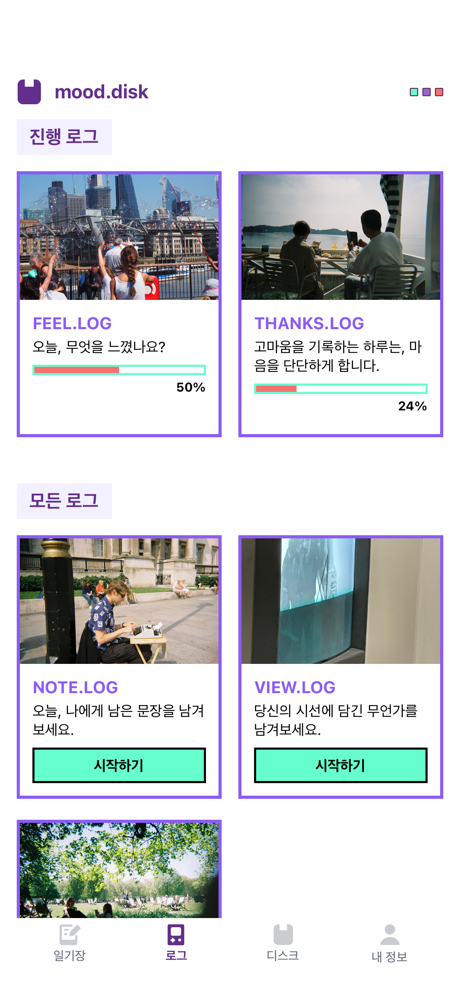
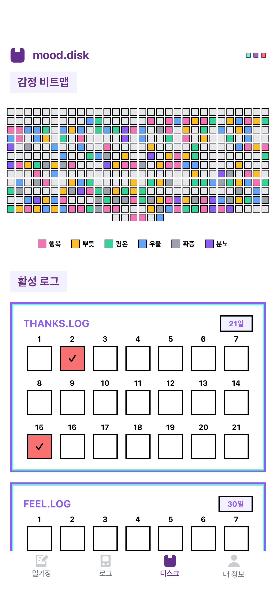
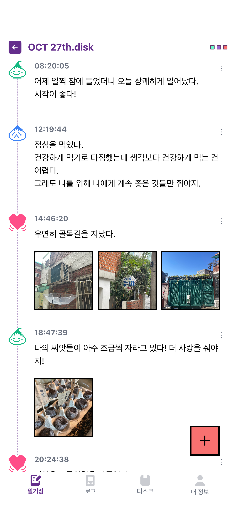
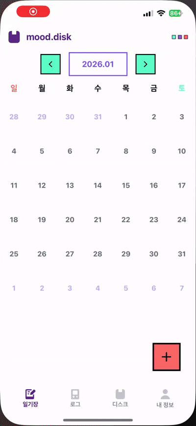
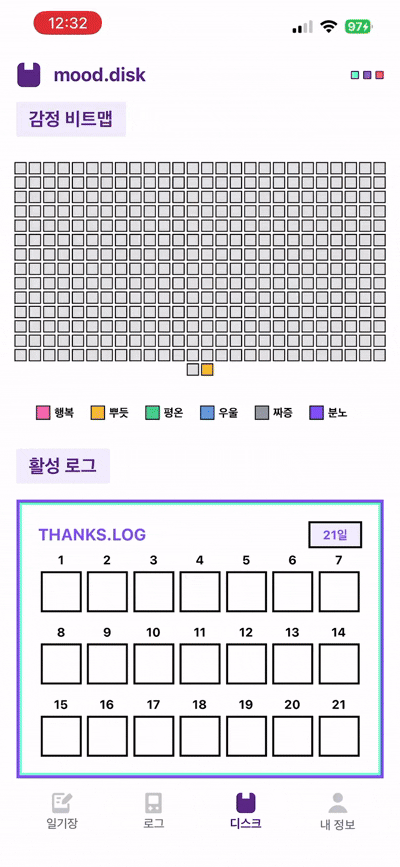
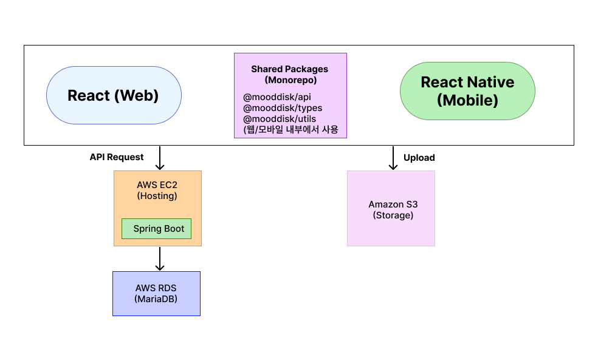

## 💾 mood.disk

↓ 순간의 감정을 기록하는 나만의 타임라인
  웹 사이트 🌐 https://mooddisk.com
  Android 📱 [https://caramel-surgeon-63d.notion.site/ASTRO-MOOD-1707035cda4f806ba428cdbc0aa3688c](https://play.google.com/store/apps/details?id=com.mooddisk.mobile)
  iOS 📱 [https://caramel-surgeon-63d.notion.site/ASTRO-MOOD-1707035cda4f806ba428cdbc0aa3688c](https://apps.apple.com/kr/app/mood-disk-%EB%82%98%EB%A7%8C%EC%9D%98-%EA%B0%90%EC%A0%95-%EC%9D%BC%EA%B8%B0/id6752386234)

## What is mood.disk?

🪐 순간의 감정을 기록하는 작은 공간. 감정과 생각, 그리고 마음을 담는 일기장.
  당신의 순간이 낭만으로 남길 바라요.

  
  
  
  
  

  
  
  

  🪐 감정 일기장

**_순간의 감정을 기록하세요._**

> 지금의 감정을 아이콘으로 선택하고, 글과 이미지를 남긴다. **_하루를 로그_**로 만들어 자신이 알지 못했던 **_자신의 감정의 흐름_**을 보여준다.

 🪐 **_로그 작성_**

**_당신만의 로그를 선택하세요._**

> 무엇을 기록할지 모른다고 해도 괜찮아요. 로그를 선택해 그 로그를 작성해보세요.

</aside>
 

 🪐 **_감정 비트맵_**

**_당신의 감정을 조각으로 만나보세요_**

> 당신의 일년의 흐름. 알록달록한 색으로 만나보세요. 언제 당신이 가장 행복했는지 알 수 있어요.

</aside>
 

## Tech Stack

### Frontend (Web)

- React
- TypeScript
- React Router
- Tailwind CSS / Styled Components

### Mobile

- React Native (Expo)
- TanStack Query

### Backend / Infra

- Spring Boot
- MariaDB
- AWS EC2, S3, RDS

## Architecture

웹·모바일 클라이언트와 API 서버를 분리하고,  
파일 스토리지(S3)와 서버(EC2)를 독립적으로 운영하는 구조입니다.

## Creator

<aside>

**🌟 박조은**

_“이것저것 만드는 사람. 창작물이 어떻게 사람들에게 닿을 수 있을지 고민하는 사람”_

</aside>
